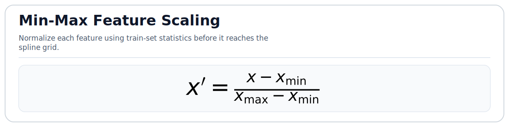
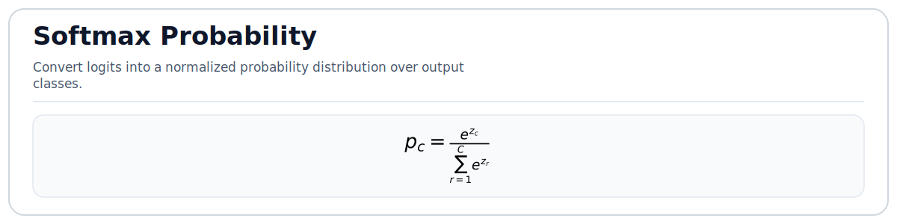
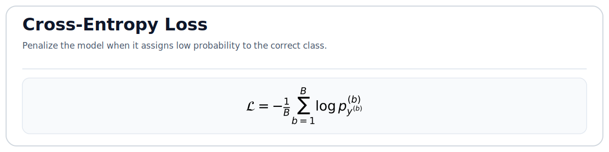
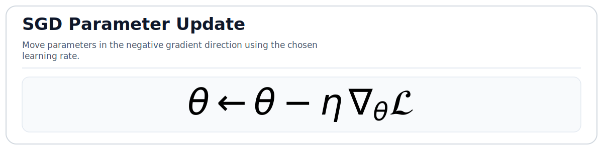
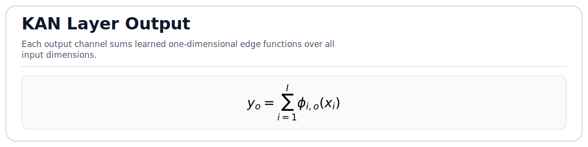
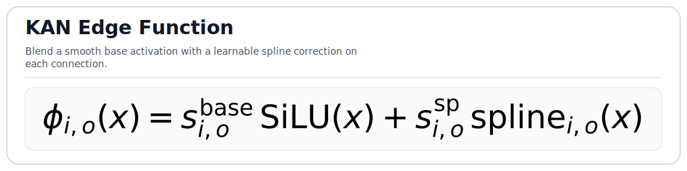
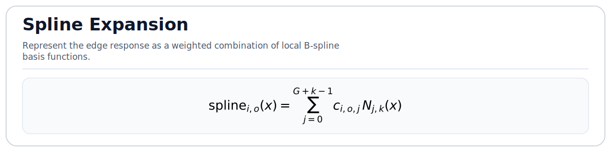
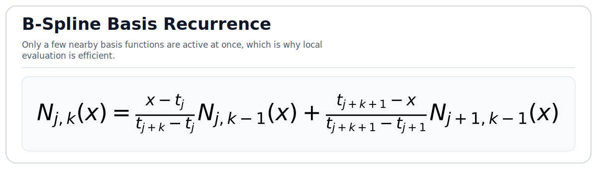

# CUDA KAN credit model (pure C++/CUDA)

This package is a pure C++/CUDA training pipeline derived from the logic in `trainModel.py`.
It does **not** use PyTorch.

## What is implemented

- CSV parsing for `train-hmda-data.csv`
- row skipping for missing values / `Exempt`
- feature selection:
  - drop `action_taken`, `loan_amount`, `income`, `loan_term`, `property_value`
  - then take remaining columns slice `[1:19]`
- stratified train/val/test split
- MinMax scaling fit on **train only**
- two-layer KAN classifier:
  - layer1: `[n_features -> hidden]`
  - layer2: `[hidden -> 2]`
- CUDA forward/backward for each KAN layer
- SGD training loop with softmax cross-entropy on CUDA

## Machine learning background

This project is a supervised learning pipeline for binary classification on tabular credit data.
Each training sample is a feature vector `x`, and the target label `y` is one of two classes.
The goal is to learn a function that maps normalized tabular inputs to two output logits, then use softmax to turn those logits into class probabilities.

The training loop follows the usual ML workflow:

1. Read the raw CSV and discard rows that cannot be used.
2. Select a subset of useful input columns.
3. Split the dataset into train, validation, and test subsets with stratification so class balance is preserved.
4. Fit MinMax scaling on the training set only, then apply the same scaling to validation and test data to avoid data leakage.
5. Train the model with mini-batch SGD and softmax cross-entropy.
6. Track train, validation, and test accuracy across epochs.

### Why scaling matters

Before training, each numeric feature is normalized with MinMax scaling fit on the training split only:



This matters for two reasons:

- it avoids data leakage, because validation and test statistics are never used to fit the scaler
- it makes the KAN spline grids easier to use, because this implementation initializes them on a fixed range near `[-1, 1]`

If one feature had a much larger numeric range than another, the spline basis on that feature would be sampled very differently and training would become harder to tune.

### From logits to probabilities

The model produces two output logits for each sample.
Those logits are converted into class probabilities with softmax:



Training minimizes mean cross-entropy over each mini-batch:



Here `B` is the mini-batch size, and `p_{y^(b)}^(b)` means the predicted probability assigned to the correct class for sample `b`.
This loss is small when the model assigns high probability to the right class and large when it is confidently wrong.

After gradients are computed, parameters are updated with SGD:



The learning rate `eta` controls how large each update is.
If it is too large, training can become unstable; if it is too small, learning becomes slow.

Why these pieces matter:

- The train split is used to fit model parameters.
- The validation split is used to estimate generalization during training and to monitor the best validation accuracy.
- The test split is kept separate so final accuracy is measured on unseen data.
- Feature scaling is especially important here because the spline grids are initialized on a fixed range near `[-1, 1]`, so normalized inputs interact with the spline basis more predictably.

The main hyperparameters exposed by `train.cpp` are:

- `hidden`: width of the hidden KAN layer
- `grid`: number of spline intervals per input dimension
- `k`: B-spline degree, clamped to at most `3` in this baseline
- `epochs`: number of training passes through the training set
- `batch`: mini-batch size
- `lr`: SGD learning rate

## KAN theory

KAN stands for Kolmogorov-Arnold Network.
The core idea is different from a standard MLP:

- In a typical MLP, edges mostly carry scalar weights and the nonlinear activation is attached to the node.
- In a KAN, each connection can learn a one-dimensional function of its input, so more of the expressive power lives on the edges themselves.

KANs are inspired by the Kolmogorov-Arnold representation theorem, which shows that multivariate continuous functions can be represented through sums and compositions of univariate functions.
Modern KAN architectures do not implement that theorem literally, but they use the same intuition: build complex mappings from learnable one-dimensional transformations.

### From MLP weights to KAN edge functions

In a dense MLP layer, an output is usually formed from scalar weights followed by an activation.
In a KAN layer, each edge contributes a learned one-dimensional function instead.
For one layer in this implementation, each output channel is formed by summing learned per-edge transforms:



This means each input dimension can learn a different nonlinear response for every output channel.
That is a major reason KANs can be expressive on tabular data: the model is not forced to treat every edge as just a scalar multiply.

### Base path plus spline path

Here each edge function `phi_{i,o}` has two parts:

- a base path using `SiLU(x)`
- a spline path using a learnable B-spline expansion

In code, the edge function is effectively:



and the spline term is:



where `N_{j,k}(x)` is the `j`-th B-spline basis function of degree `k`.
The symbol `G` in the formula corresponds to `grid_intervals` in the code.

The base `SiLU` branch gives each edge a smooth default nonlinear shape, while the spline branch adds local, data-dependent corrections.
That combination is useful in practice: the base path keeps the model from being entirely dependent on the spline coefficients, and the spline path gives the network finer control where the data needs it.

### Why B-splines are used

B-splines are attractive because they have local support.
Changing one coefficient mainly affects the function in a limited region of the input axis instead of everywhere at once.
That makes the learned edge functions easier to tune and interpret.

The recursive definition of the basis looks like:



You do not need to evaluate the whole basis over the whole grid for every sample.
For a given input value, only a small number of basis functions around the active knot span are nonzero.
That property is exactly what the CUDA kernels exploit: they first find the span, then compute only the local basis values needed for accumulation and backpropagation.

How that maps to this codebase:

- `grid` stores the knot positions for each input dimension of a layer.
- Each input dimension has its own knot grid, shared across output channels in that layer.
- `coef` stores spline coefficients for each input-output edge.
- `scale_base` weights the SiLU branch.
- `scale_sp` weights the spline branch.
- `kan_forward_kernel` evaluates the spline basis and accumulates the layer output.
- `kan_backward_kernel` computes gradients for inputs, spline coefficients, and scale terms.

Implementation-specific notes:

- The spline grid is initialized uniformly from `-1` to `1`.
- The number of knots is `grid_intervals + 2 * k`.
- The number of spline coefficients is `grid_intervals + k`.
- This baseline uses two KAN layers: `input -> hidden` and `hidden -> 2`.
- The last layer outputs two logits for binary classification.
- The forward kernel uses shared memory for the current knot grid and coefficient tile.
- Gradients in the backward CUDA kernel rely on `atomicAdd`, which is simple and correct in structure but not the final optimized form.

Intuitively, increasing `grid` gives each edge function more local detail, while increasing `hidden` gives the network more intermediate channels to combine those learned one-dimensional transforms.
Increasing `k` makes the basis smoother and slightly less local.
Those three knobs, `grid`, `hidden`, and `k`, define most of the model-capacity tradeoff in this baseline.

## File layout

- `assets/formulas/*.svg`
- `include/csv_reader.h`
- `include/preprocess.h`
- `include/kan_cuda_kernels.h`
- `include/kan_model.h`
- `src/csv_reader.cpp`
- `src/preprocess.cpp`
- `src/kan_model.cpp`
- `src/kan_cuda_kernels.cu`
- `src/train.cpp`
- `CMakeLists.txt`

## Build

```bash
mkdir build
cd build
cmake ..
cmake --build . -j
```

## Build on Visual Studio 2022

### Prerequisites

- Visual Studio 2022 with `Desktop development with C++`
- CUDA Toolkit with Visual Studio integration installed
- For GeForce RTX 50-series GPUs, use CUDA Toolkit `12.8` or newer
- NVIDIA Nsight Visual Studio Edition installed
- NVIDIA driver and a real CUDA-capable GPU on the machine where you debug/profile

### Generate the VS 2022 solution with CMake presets

Debug build for stepping through kernels:

```powershell
cmake --preset vs2022-debug
cmake --build --preset vs2022-debug
```

Profiling build with symbols and line info, but without `-G`:

```powershell
cmake --preset vs2022-relwithdebinfo
cmake --build --preset vs2022-relwithdebinfo
```

Open the generated `.sln` from the corresponding `build/vs2022-*` directory in Visual Studio.

### Generate the solution manually

If you prefer direct `cmake` commands instead of presets:

```powershell
cmake -S . -B build\vs2022-debug -G "Visual Studio 17 2022" -A x64 -DKAN_ENABLE_CUDA_DEBUG=ON -DKAN_ENABLE_CUDA_LINEINFO=ON -DCMAKE_CUDA_ARCHITECTURES=120
cmake --build build\vs2022-debug --config Debug
```

```powershell
cmake -S . -B build\vs2022-relwithdebinfo -G "Visual Studio 17 2022" -A x64 -DKAN_ENABLE_CUDA_DEBUG=OFF -DKAN_ENABLE_CUDA_LINEINFO=ON -DCMAKE_CUDA_ARCHITECTURES=120
cmake --build build\vs2022-relwithdebinfo --config RelWithDebInfo
```

Notes:
- Change `CMAKE_CUDA_ARCHITECTURES` to match your GPU SM version for faster builds. Example: `86` for many RTX 30 cards, `89` for many RTX 40 cards, `120` for RTX 50 cards.
- If you have multiple CUDA toolkits installed, you can add `-T cuda=<toolkit-version>` to the manual configure command.
- The Visual Studio target is set up to launch `kan_credit_train` with `train-hmda-data.csv 16 8 3 20 512 0.01` by default.

### Compile inside Visual Studio 2022

After the solution is generated:

1. Open `build/vs2022-debug/kan_credit_cuda.sln` or `build/vs2022-relwithdebinfo/kan_credit_cuda.sln`.
2. In the Visual Studio toolbar, select the `x64` platform.
3. Select `Debug` when you want to debug kernels, or `RelWithDebInfo` when you want to profile with near-release performance.
4. Right-click `kan_credit_train` and choose `Set as Startup Project` if it is not already selected.
5. Build with `Build > Build Solution` or press `Ctrl+Shift+B`.

The executable will be produced under the usual Visual Studio configuration directory, for example:

- `build\vs2022-debug\Debug\kan_credit_train.exe`
- `build\vs2022-relwithdebinfo\RelWithDebInfo\kan_credit_train.exe`

## Run

```bash
./kan_credit_train /path/to/train-hmda-data.csv 16 8 3 20 512 0.01
```

Arguments:
1. csv path
2. hidden width (default `16`)
3. grid intervals (default `8`)
4. spline degree k (default `3`, clamped to `<= 3` in this baseline)
5. epochs (default `20`)
6. batch size (default `512`)
7. learning rate (default `0.01`)

## Debug CUDA kernels with NVIDIA Nsight

Use the `Debug` configuration when you want to step into `kan_forward_kernel` or `kan_backward_kernel` on a real CUDA GPU.

### Build for debugging

1. Build the `vs2022-debug` preset or a manual `Debug` configuration with `KAN_ENABLE_CUDA_DEBUG=ON`.
2. Open the generated solution in Visual Studio 2022.
3. Make sure `kan_credit_train` is the startup project.

Why this setup matters:
- `KAN_ENABLE_CUDA_DEBUG=ON` adds `-G`, which makes device code debuggable.
- `KAN_ENABLE_CUDA_LINEINFO=ON` keeps source-to-SASS/PTX line mapping available.
- The working directory is the CMake build directory, and the dataset is copied there automatically.

### Start a kernel debug session in Nsight VSE

1. Set one or more breakpoints in `src/kan_cuda_kernels.cu`, for example inside `kan_forward_kernel` or `kan_backward_kernel`.
2. Keep the run small while debugging. A short command line like `train-hmda-data.csv 16 8 3 1 64 0.01` is easier to step through.
3. Start the program with the CUDA debugger provided by NVIDIA Nsight Visual Studio Edition.
4. When execution stops in device code, inspect the current CUDA thread, block, warp, local variables, and call stack in the Nsight debug windows.
5. Use step commands to move through the kernel just like host code, then continue until the next interesting launch or breakpoint.

Practical tips:
- If a breakpoint is not hit, verify you are running the `Debug` configuration and not `RelWithDebInfo`.
- `-G` can change performance significantly, so use it only for debugging.
- Kernel launches are easier to reason about with fewer epochs and a smaller batch size.
- If you need deterministic host-side ordering while debugging, enable `CUDA_LAUNCH_BLOCKING=1`.

Useful debug-time environment variables:

```powershell
set CUDA_LAUNCH_BLOCKING=1
set CUDA_DEVICE_WAITS_ON_EXCEPTION=1
```

For memory errors and races, run the executable under Compute Sanitizer:

```powershell
compute-sanitizer --tool memcheck build\vs2022-debug\Debug\kan_credit_train.exe train-hmda-data.csv 16 8 3 1 128 0.01
compute-sanitizer --tool racecheck build\vs2022-debug\Debug\kan_credit_train.exe train-hmda-data.csv 16 8 3 1 128 0.01
```

## Profiling the KAN kernels on a real CUDA device

Do not profile a `Debug` build with `-G`; it changes kernel code generation too much. Use `RelWithDebInfo` instead.

Recommended flow:

1. Build `vs2022-relwithdebinfo`.
2. Run a normal training pass once to warm up the GPU and CUDA context.
3. Profile the second run with Nsight Compute or Nsight Systems.

Nsight Compute for kernel-level metrics:

```powershell
ncu --target-processes all --set full --import-source yes -o build\vs2022-relwithdebinfo\ncu_kan build\vs2022-relwithdebinfo\RelWithDebInfo\kan_credit_train.exe train-hmda-data.csv 16 8 3 20 512 0.01
```

Nsight Systems for end-to-end GPU timeline:

```powershell
nsys profile --trace=cuda,osrt --sample=none -o build\vs2022-relwithdebinfo\nsys_kan build\vs2022-relwithdebinfo\RelWithDebInfo\kan_credit_train.exe train-hmda-data.csv 16 8 3 20 512 0.01
```

What to look at first:
- `kan_forward_kernel` and `kan_backward_kernel` duration
- achieved occupancy
- memory throughput and shared-memory utilization
- the cost of `atomicAdd` in backward
- whether batch size changes shift the hotspot from math to memory traffic

## Important notes

This is a **clean baseline CUDA implementation**, not a full feature-parity port of PyKAN.
Not implemented:
- Optuna search
- LBFGS optimizer
- symbolic regression / plotting
- model checkpoint serialization
- ROC/PR plotting

The CUDA kernels are based on the earlier custom KAN kernel and use shared memory in forward for knot grid and coefficient tiles.
Backward is correct in structure but still relies on `atomicAdd`, so it is not the final optimized production version.
